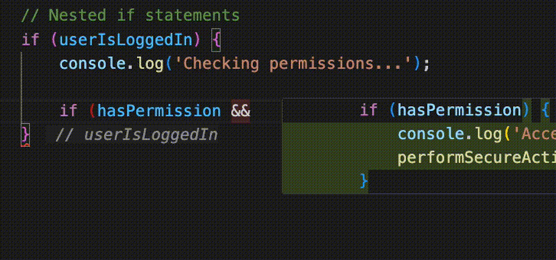

# If End Marker

[](https://marketplace.visualstudio.com/items?itemName=lacymorrow.vscode-if-end-marker)
[](https://opensource.org/licenses/MIT)

A VS Code extension that displays if conditions as subtle inline markers at the end of if statements in JavaScript and TypeScript files. This helps developers quickly understand the context of closing braces in long if blocks, improving code readability and reducing cognitive load.



## Features

- **Ghost Text Display**: Shows the condition of if statements as inline hints at the closing brace
- **Smart Visibility**: Only displays ghost text for if statements spanning 3 or more lines
- **Multi-language Support**: Works with:
  - JavaScript (.js, .mjs, .cjs)
  - TypeScript (.ts)
  - JSX (.jsx)
  - TSX (.tsx)
- **Configurable**: Customize maximum condition length and enable/disable functionality
- **Theme-aware**: Ghost text automatically adapts to your VS Code theme

## Installation

### From VS Code Marketplace

1. Open VS Code
2. Press `Ctrl+P` / `Cmd+P` to open the Quick Open dialog
3. Type `ext install lacymorrow.vscode-if-end-marker`
4. Press Enter

### From VSIX Package

1. Download the latest `.vsix` file from the [Releases](https://github.com/lacymorrow/vscode-if-end-marker/releases) page
2. Open VS Code
3. Press `Ctrl+Shift+P` / `Cmd+Shift+P`
4. Type "Install from VSIX" and select the command
5. Choose the downloaded `.vsix` file

### Development Installation

1. Clone this repository:
   ```bash
   git clone https://github.com/lacymorrow/vscode-if-end-marker.git
   cd vscode-if-end-marker
   ```

2. Install dependencies:
   ```bash
   npm install
   ```

3. Compile the extension:
   ```bash
   npm run compile
   ```

4. Package and install:
   ```bash
   npm run package
   code --install-extension vscode-if-end-marker-*.vsix
   ```

## Usage

The extension activates automatically when you open JavaScript or TypeScript files. Ghost text will appear at the end of if statements that span multiple lines.

### Example

```javascript
if (userIsLoggedIn && 
    hasPermission &&
    !isExpired) {
    // Your code here
    performAction();
    updateUI();
} // userIsLoggedIn && hasPermission &&...
```

## Configuration

Configure the extension through VS Code settings (`Ctrl+,` / `Cmd+,`):

| Setting | Type | Default | Description |
|---------|------|---------|-------------|
| `ifEndGhostText.enabled` | boolean | `true` | Enable/disable the extension |
| `ifEndGhostText.maxConditionLength` | number | `40` | Maximum characters to display from the condition |
| `ifEndGhostText.maxFileSize` | number | `500000` | Maximum file size (in characters) to process |
| `ifEndGhostText.debounceDelay` | number | `300` | Delay in milliseconds before updating decorations |
| `ifEndGhostText.minLineCount` | number | `4` | Minimum lines an if statement must span |

### Example Configuration

```json
{
  "ifEndGhostText.enabled": true,
  "ifEndGhostText.maxConditionLength": 50,
  "ifEndGhostText.maxFileSize": 1000000,
  "ifEndGhostText.debounceDelay": 400,
  "ifEndGhostText.minLineCount": 3
}
```

## Development

### Prerequisites

- Node.js 16.x or higher
- VS Code 1.74.0 or higher

### Building from Source

```bash
# Install dependencies
npm install

# Compile TypeScript
npm run compile

# Watch for changes
npm run watch

# Run linting
npm run lint

# Package extension
npm run package
```

### Testing

```bash
# Run tests
npm test
```

### Publishing

```bash
# Patch release (1.0.0 -> 1.0.1)
npm run release:patch

# Minor release (1.0.0 -> 1.1.0)
npm run release:minor

# Major release (1.0.0 -> 2.0.0)
npm run release:major
```

## Contributing

Contributions are welcome! Please read our [Contributing Guidelines](CONTRIBUTING.md) before submitting PRs.

1. Fork the repository
2. Create your feature branch (`git checkout -b feature/amazing-feature`)
3. Commit your changes (`git commit -m 'Add amazing feature'`)
4. Push to the branch (`git push origin feature/amazing-feature`)
5. Open a Pull Request

### Development Workflow

1. Make your changes
2. Run `npm run compile` to build
3. Press `F5` in VS Code to launch a new Extension Development Host
4. Test your changes
5. Run `npm run lint` to check for issues

## Performance

The extension is optimized for performance with:
- **Caching**: Parse results are cached and reused when possible
- **Viewport-based rendering**: Only processes visible code
- **Debouncing**: Updates are delayed during rapid typing
- **File size limits**: Large files can be automatically skipped
- **Optimized parsing**: Uses efficient string operations and pre-compiled regex

### Performance Tips

1. For very large files, increase `maxFileSize` or set to `0` to disable the limit
2. Increase `debounceDelay` if you experience lag during typing
3. Adjust `minLineCount` to control when ghost text appears

## Known Issues

- Complex nested if statements may not always be parsed correctly
- The parser uses a regex-based approach which may miss some edge cases
- Conditions containing string literals with parentheses might be truncated incorrectly

## Troubleshooting

### Ghost text not appearing

1. Check if the extension is enabled in settings
2. Ensure your if statement spans at least 3 lines
3. Verify the file type is supported (JS/TS/JSX/TSX)
4. Try reloading VS Code (`Ctrl+R` / `Cmd+R`)

### Performance issues

If you experience performance issues with large files:
1. Consider increasing `ifEndGhostText.maxConditionLength`
2. Temporarily disable the extension for very large files
3. Report the issue with file details

## Changelog

See [CHANGELOG.md](CHANGELOG.md) for a list of changes in each version.

## License

This project is licensed under the MIT License - see the [LICENSE](LICENSE) file for details.

## Acknowledgments

- Inspired by similar features in other IDEs
- Built with the [VS Code Extension API](https://code.visualstudio.com/api)
- Theme-aware styling adapted from VS Code's inlay hints

## Support

- **Issues**: [GitHub Issues](https://github.com/lacymorrow/vscode-if-end-marker/issues)
- **Discussions**: [GitHub Discussions](https://github.com/lacymorrow/vscode-if-end-marker/discussions)
- **Marketplace**: [VS Code Marketplace Page](https://marketplace.visualstudio.com/items?itemName=lacymorrow.vscode-if-end-marker)

---

Made with ❤️ for the VS Code community