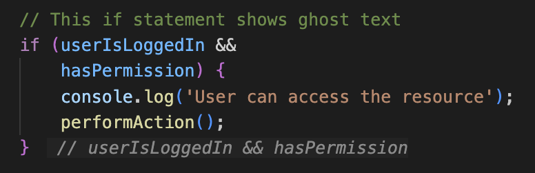

<div align="center">
  
</div>

# VS Code If-End Marker

[](https://marketplace.visualstudio.com/items?itemName=shipkit.vscode-if-end-marker)
[](https://marketplace.visualstudio.com/items?itemName=shipkit.vscode-if-end-marker)
[](https://marketplace.visualstudio.com/items?itemName=shipkit.vscode-if-end-marker)
[](https://opensource.org/licenses/MIT)

> Never lose track of which `if` statement you're closing again! 🎯

A lightweight VS Code extension that displays subtle, inline markers showing the condition of `if` statements at their closing braces. Perfect for navigating complex conditional logic in JavaScript and TypeScript projects.



## ✨ Why If-End Marker?

Ever found yourself scrolling up to remember what condition that closing brace belongs to? If-End Marker solves this by displaying the original condition right where you need it - at the closing brace.

```javascript
if (user.isAuthenticated && 
    user.hasPermission('admin') && 
    !user.accountLocked) {
    // ... 50 lines of code ...
    
    performAdminAction();
    updateAuditLog();
} // user.isAuthenticated && user.hasPermission('admin') &&...
  ↑ This appears automatically!
```

## 🚀 Features

- **🔍 Smart Detection**: Automatically shows markers for multi-line if statements
- **🎨 Theme Integration**: Markers adapt to your VS Code theme using native inlay hint colors
- **⚡ Blazing Fast**: Optimized for large codebases with smart caching and viewport rendering
- **🛠️ Fully Configurable**: Customize when and how markers appear
- **📝 Multi-language Support**: Works with JS, TS, JSX, TSX, MJS, and CJS files

## 📦 Installation

### From VS Code Marketplace

1. Open VS Code
2. Press `Ctrl+P` / `Cmd+P` to open the Quick Open dialog
3. Type `ext install shipkit.vscode-if-end-marker`
4. Press Enter

### From VSIX Package

1. Download the latest `.vsix` file from the [Releases](https://github.com/lacymorrow/vscode-if-end-marker/releases) page
2. Open VS Code
3. Press `Ctrl+Shift+P` / `Cmd+Shift+P`
4. Type "Install from VSIX" and select the command
5. Choose the downloaded `.vsix` file

### Development Installation

1. Clone this repository:
   ```bash
   git clone https://github.com/lacymorrow/vscode-if-end-marker.git
   cd vscode-if-end-marker
   ```

2. Install dependencies:
   ```bash
   npm install
   ```

3. Compile the extension:
   ```bash
   npm run compile
   ```

4. Package and install:
   ```bash
   npm run package
   code --install-extension vscode-if-end-marker-*.vsix
   ```

## 💡 Usage

The extension activates automatically when you open JavaScript or TypeScript files. Markers will appear at the end of if statements that span multiple lines.

### Command Palette Commands

Access these commands through the Command Palette (`Ctrl+Shift+P` / `Cmd+Shift+P`):

- **If-End Marker: Toggle Markers** - Toggle the extension on/off
- **If-End Marker: Enable Markers** - Enable the extension
- **If-End Marker: Disable Markers** - Disable the extension

### Example

```javascript
if (userIsLoggedIn && 
    hasPermission &&
    !isExpired) {
    // Your code here
    performAction();
    updateUI();
} // userIsLoggedIn && hasPermission &&...
```

## ⚙️ Configuration

Configure the extension through VS Code settings (`Ctrl+,` / `Cmd+,`):

| Setting | Type | Default | Description |
|---------|------|---------|-------------|
| `vscodeIfEndMarker.enabled` | boolean | `true` | Enable/disable the extension |
| `vscodeIfEndMarker.maxConditionLength` | number | `50` | Maximum characters to display from the condition |
| `vscodeIfEndMarker.maxFileSize` | number | `500000` | Maximum file size (in characters) to process |
| `vscodeIfEndMarker.debounceDelay` | number | `300` | Delay in milliseconds before updating decorations |
| `vscodeIfEndMarker.minLineCount` | number | `4` | Minimum lines an if statement must span |

### Example Configuration

```json
{
  "vscodeIfEndMarker.enabled": true,
  "vscodeIfEndMarker.maxConditionLength": 60,
  "vscodeIfEndMarker.maxFileSize": 1000000,
  "vscodeIfEndMarker.debounceDelay": 400,
  "vscodeIfEndMarker.minLineCount": 3
}
```

## 🏃‍♂️ Performance

The extension is optimized for performance with:
- **Caching**: Parse results are cached and reused when possible
- **Viewport-based rendering**: Only processes visible code
- **Debouncing**: Updates are delayed during rapid typing
- **File size limits**: Large files can be automatically skipped
- **Optimized parsing**: Uses efficient string operations and pre-compiled regex

### Performance Tips

1. For very large files, increase `maxFileSize` or set to `0` to disable the limit
2. Increase `debounceDelay` if you experience lag during typing
3. Adjust `minLineCount` to control when markers appear

## 🧑‍💻 Development

### Prerequisites

- Node.js 16.x or higher
- VS Code 1.74.0 or higher

### Building from Source

```bash
# Install dependencies
npm install

# Compile TypeScript
npm run compile

# Watch for changes
npm run watch

# Run linting
npm run lint

# Package extension
npm run package
```

### Testing

```bash
# Run tests
npm test
```

### Publishing

This project uses automated versioning and changelog generation based on commit messages.

```bash
# Automatic version bump based on commits
npm run release

# Force specific version bump
npm run release:patch  # 1.0.0 -> 1.0.1
npm run release:minor  # 1.0.0 -> 1.1.0
npm run release:major  # 1.0.0 -> 2.0.0
```

#### Commit Message Format

Follow [Conventional Commits](https://www.conventionalcommits.org/):

- `feat: Add new feature` → Minor version bump
- `fix: Fix bug` → Patch version bump
- `feat!: Breaking change` → Major version bump
- `perf: Improve performance` → Patch version bump
- `docs: Update README` → No version bump
- `chore: Update dependencies` → No version bump

## 🤝 Contributing

Contributions are welcome! Please read our [Contributing Guidelines](CONTRIBUTING.md) before submitting PRs.

1. Fork the repository
2. Create your feature branch (`git checkout -b feature/amazing-feature`)
3. Commit your changes (`git commit -m 'Add amazing feature'`)
4. Push to the branch (`git push origin feature/amazing-feature`)
5. Open a Pull Request

### Development Workflow

1. Make your changes
2. Run `npm run compile` to build
3. Press `F5` in VS Code to launch a new Extension Development Host
4. Test your changes
5. Run `npm run lint` to check for issues

## 🐛 Known Issues

- Complex nested if statements may not always be parsed correctly
- The parser uses a regex-based approach which may miss some edge cases
- Conditions containing string literals with parentheses might be truncated incorrectly

## 🔧 Troubleshooting

### Markers not appearing

1. Check if the extension is enabled in settings
2. Ensure your if statement spans at least 4 lines (configurable)
3. Verify the file type is supported (JS/TS/JSX/TSX)
4. Try reloading VS Code (`Ctrl+R` / `Cmd+R`)

### Performance issues

If you experience performance issues with large files:
1. Consider increasing `vscodeIfEndMarker.maxFileSize`
2. Temporarily disable the extension for very large files
3. Report the issue with file details

## 📝 Releases

See the [Releases page](https://github.com/lacymorrow/vscode-if-end-marker/releases) for a full changelog. Each release includes:
- Automated changelog from commit messages
- Pre-built `.vsix` file for manual installation
- Source code archives

## 📄 License

This project is licensed under the MIT License - see the [LICENSE](LICENSE) file for details.

## 🙏 Acknowledgments

- Inspired by similar features in JetBrains IDEs
- Built with the [VS Code Extension API](https://code.visualstudio.com/api)
- Theme-aware styling adapted from VS Code's inlay hints

## 📞 Support

- **Issues**: [GitHub Issues](https://github.com/lacymorrow/vscode-if-end-marker/issues)
- **Discussions**: [GitHub Discussions](https://github.com/lacymorrow/vscode-if-end-marker/discussions)
- **Marketplace**: [VS Code Marketplace Page](https://marketplace.visualstudio.com/items?itemName=shipkit.vscode-if-end-marker)

---

<p align="center">
  Made with ❤️ by <a href="https://shipkit.io">Shipkit</a> • <a href="https://github.com/lacymorrow">Lacy Morrow</a>
</p>

<p align="center">
  <a href="https://github.com/lacymorrow/vscode-if-end-marker/issues">Report Bug</a> •
  <a href="https://github.com/lacymorrow/vscode-if-end-marker/issues">Request Feature</a> •
  <a href="https://marketplace.visualstudio.com/items?itemName=shipkit.vscode-if-end-marker">Rate on Marketplace</a>
</p>